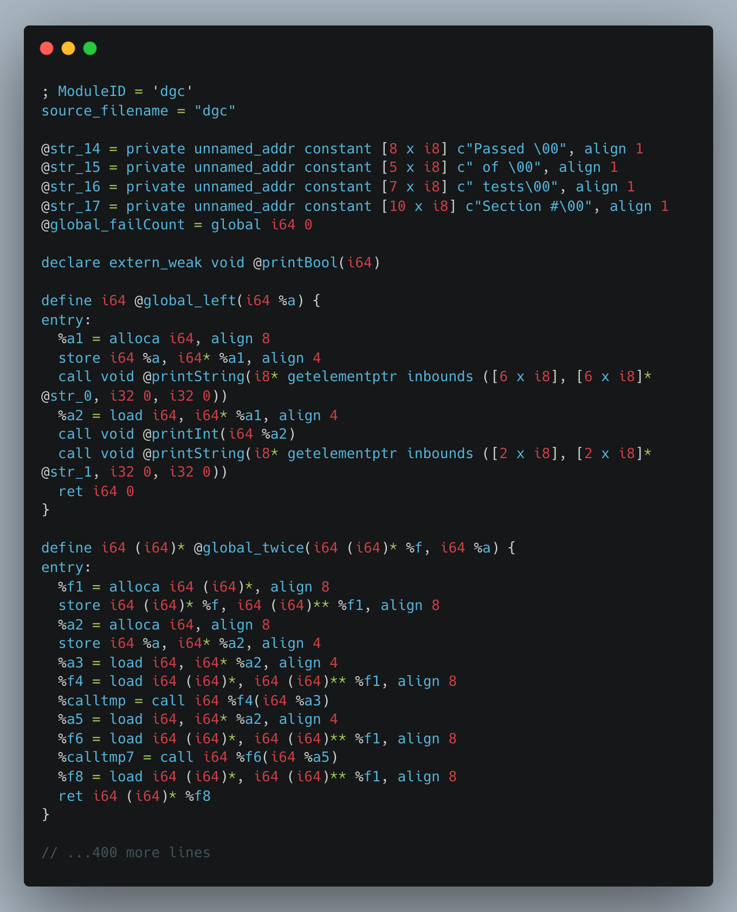
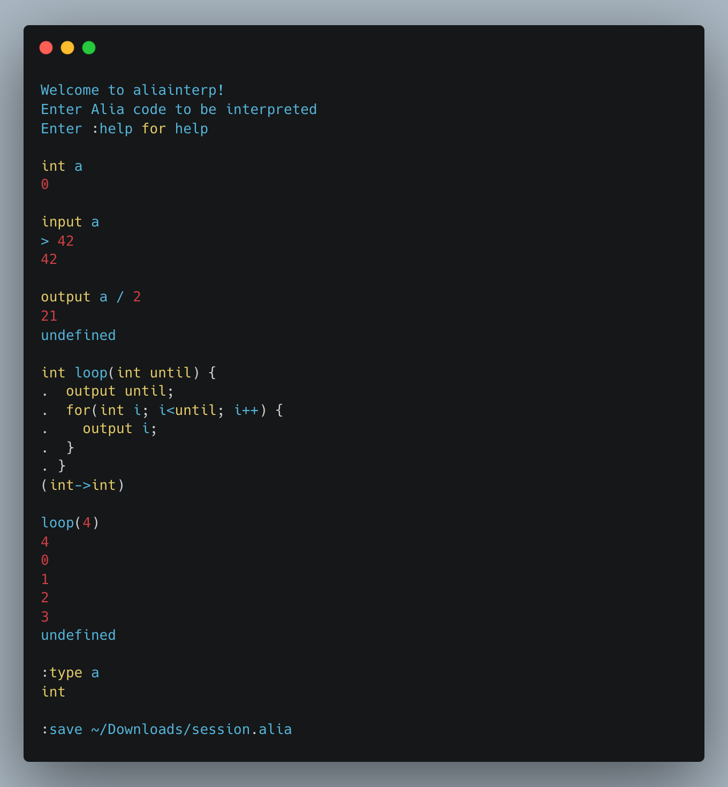
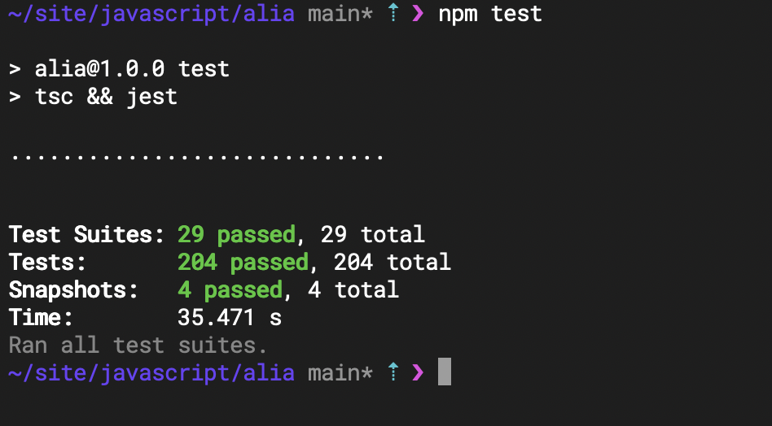
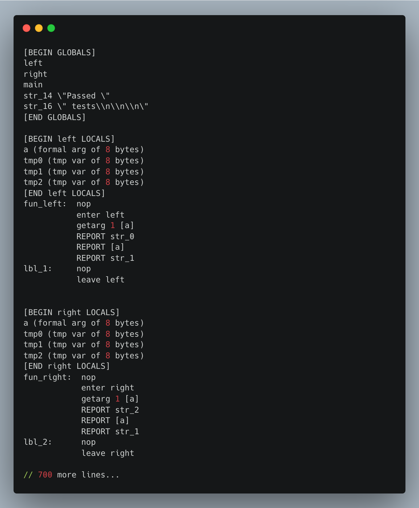
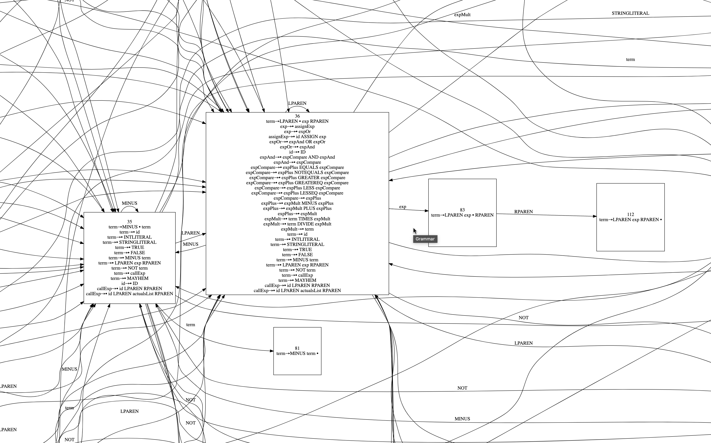

# dgc

The ultimate Drewgon compiler and interpreter.

// TODO: rename the language (check for references to dg, dgc, dragon, Drewgon)

Written in TypeScript.

Drewgon follows c-like syntax. Example code:

```javascript
int x;

int double(int x) {
    return x * 2;
}

int main() {
  output "Hello World!\n";
  
  // Function Pointer
  fn(int)->int f = double;
  
  output "Input a number: ";
  input x;
  
  if(x == 42) {
    output "The answer to the \"ultimate question of life, the universe, and everything,\"\n";
  }
  
  return f(x);
}
```

A larger example is provided in [`./infile.dg`](./infile.dg). It includes an
implementation of a tiny testing library, that is then used to test the very
language it is written in.

Drewgon can be compiled down
to [x64, MIPS, and LLVM assembly](#running-compiler). It can also be
run in an [interpreter](#running-interpreter).

## Contents

- [dgc](#dgc)
    * [Contents](#contents)
    * [Prerequisites](#prerequisites)
    * [Installation](#installation)
    * [Running Compiler](#running-compiler)
        + [Compiling to x64](#compiling-to-x64)
        + [Compiling to MIPS](#compiling-to-mips)
        + [Compiling to LLVM Assembly](#compiling-to-llvm-assembly)
    * [Running Interpreter](#running-interpreter)
    * [Testing](#testing)
    * [Architecture](#architecture)
        + [Lexical Analysis (Tokenizing)](#lexical-analysis-tokenizing)
        + [Syntactic analysis (Parsing)](#syntactic-analysis-parsing)
            - [Syntax directed translation](#syntax-directed-translation)
                * [Parse tree generation](#parse-tree-generation)
                    + [(optional) Prettify the code](#optional-prettify-the-code)
                * [Abstract syntax tree (AST) generation](#abstract-syntax-tree-ast-generation)
                    + [(optional) Prettify the code](#optional-prettify-the-code-1)
        + [Semantic analysis](#semantic-analysis)
            - [Name analysis](#name-analysis)
            - [Type analysis](#type-analysis)
        + [Intermediate code generation](#intermediate-code-generation)
            - [Intermediate code optimization](#intermediate-code-optimization)
        + [Final code generation](#final-code-generation)
            - [Final code optimization](#final-code-optimization)
        + [Execution](#execution)
            - [Runtime environment](#runtime-environment)
                * [MIPS](#mips)
                * [x64 and LLVM](#x64-and-llvm)
            - [Interpreter](#interpreter)
    * [`dgc` Documentation](#dgc-documentation)
    * [Development Documentation](#development-documentation)
    * [Appendix 1: Extending the language](#appendix-1-extending-the-language)
    * [Appendix 2: Generating a graph of the grammar](#appendix-2-generating-a-graph-of-the-grammar)
    * [Appendix 3: Sources](#appendix-3-sources)
        + [CYK Parser](#cyk-parser)
        + [SLR Parser](#slr-parser)
        + [MIPS](#mips-1)
        + [x64](#x64)
        + [LLVM](#llvm)

## Prerequisites

- Node 18
- NPM 8

## Installation

1. [Follow `llvm-bindings` installation instructions](https://github.com/ApsarasX/llvm-bindings/tree/69c93f7aae697c3cb3e75d01e447554b0565e3d5#install)

   Also, you may have
   to [explicitly specify the location of LLVM](https://github.com/ApsarasX/llvm-bindings/tree/69c93f7aae697c3cb3e75d01e447554b0565e3d5#custom-llvm-installation)
   ,
   if it isn't found automatically.

2. Install dgc dependencies:

   ```sh
   npm install
   ```

## Running Compiler

To see available options, run the script with the `--help` argument:

```sh
./dgc --help
```

### Compiling to x64

Example call:

```sh
./dgc infile.dg -o outfile.s
```

By default, compilation runs intermediate code optimization and final code
optimization (using peephole optimization and dead code elimination). You can
disable those by running the compiler with the `--dontOptimize` flag (useful
when trying to debug the output)

After compiling, you need to run a linker. This can be done
using the `make link` command, which accepts optional arguments:

```sh
make link OUTFILE=outfile.s PROG=dev.prog
```

Where:

- `OUTFILE` is the name of the assembly file generated in the previous
  step (`outfile.s` is the default value).
- `PROG` is the name of the executable for the program (`dev.prog` is the
  default value).

Example of generated x64 assembly:


[Full example](./src/quads/__tests__/__snapshots__/toAmd.test.ts.snap)

### Compiling to MIPS

Example call:

```
./dgc infile.dg -m mips.asm 2> errors.txt
```

Then, open `mips.asm` in MARS and run it.

MIPS assembly code was written to work with MARS 4.5

> NOTE: when compiling to MIPS, registers are stored as 32-bit values to
> simplify the multiplication and division operations


Example of generated MIPS assembly:


[Full example](./src/quads/__tests__/__snapshots__/toMips.test.ts.snap)

### Compiling to LLVM Assembly

Workflow for an x64 machine:

```sh
# Compile to LLVM assembly
./dgc infile.dg -l llvm.ll

# Optimize the LLVM assembly
# NOTE, you will have to change the paths to the LLVM binaries
/home/a807d786/llvm_dist/bin/opt -O3 -S llvm.ll -o llvm.opt.ll

# Compile to target machine assembly
/home/a807d786/llvm_dist/bin/llc llvm.opt.ll -o llvm.s

# Create an executable and run it
make link OUTFILE=llvm.s

```

Example LLVM output:



[Full example](./src/quads/__tests__/__snapshots__/toLlvm.test.ts.snap)

## Running Interpreter

Start the interpreter:

```sh
./dragoninterp
```

The interpreter supports several meta-commands. Type `:help` to see those.

Several restrictions are lifted when running Drewgon in an interpreter:

- Semicolon for the last line is optional
- Variable re-declarations are treated as shadowing the variable, rather than
  emit an error
- Statements can be included outside of the function
- `output` statements always include a trailing newline

Example Interpreter session:



## Testing

Jest is used for unit testing.

You can run it like this:

```sh
make test
```

For example, automated tests for the interpreter are in
[./src/interpreter/__
tests__/runtime.test.ts](./src/interpreter/__tests__/runtime.test.ts)

Example test run:



## Architecture

A deep dive into the architecture of the compiler follows.

`dgc` consists of 5 parts. When compiling a program, you go through each of
these
stages in order:

### Lexical Analysis (Tokenizing)

> Lexical analysis means grouping a stream of letters or sounds into sets of
> units that represent meaningful syntax

This process converts the source code into a stream of tokens. Example of
tokens:

- Reserved keywords (`if`, `else`, `while`, etc.)
- Identifiers (`foo`, `bar`, etc.)
- Operators (`+`, `-`, etc.)
- Literals (`1`, `2`, `3`, etc.)
- Comments (`// this is a comment`)

Source code for tokenizer is in [`./src/tokenize`](./src/tokenize)

Each file in that directory has a comment at the top describing the purpose
of the file.

You can run the compiler in tokenizing-only mode like this:

```sh
./dgc infile.dg --tokensOutput tokens.out
```

This would output the token stream into `./tokens.out` text file.

Example token stream:


### Syntactic analysis (Parsing)

The syntactic analysis makes sure that the token stream created in the previous
step
conforms to the grammar, and sets the stage up for Syntax Directed Translation.

The grammar for the language is defined using Context Free Grammar.

See [`./src/grammar`](./src/grammar) for the grammar definition.

Three parsers have been implemented:

- SLR Parser (default)

  This parser is used by default. You can explicitly specify it like this:

  ```sh
  ./dgc infile.dg --parser SLR -m mips.asm
  ```

  The source code for the SLR parser is in [`./src/slrParser`](./src/slrParser)

  [More information about SLR parsers](http://www.egr.unlv.edu/~matt/teaching/SLR.pdf)

  Additionally, there is an option to [generate a Graphviz graph based on the
  SLR automata](#appendix-2-generating-a-graph-of-the-grammar).

- CYK Parser

  Benefits:
    - Supports ambiguous grammar

  Drawbacks:
    - Runs as `n^3` complexity.
    - Requires converting grammar to Chomsky Normal Form, thus was harder to
      implement
    - Hard to convert the result of the CYK parser into a parse tree

  For these reasons, the CYK parser was implemented only out of curiosity rather
  than for practical reasons. You can run the CYK parser to see whether
  parsing resulted in any errors, but you cannot move on to the
  "Syntax directed translation" if CYK parser was used.

  You can run the CYK Parser like this:

  ```sh
  ./dgc infile.dg --parser CYK
  ```

  The program will exit with exit code 0 on successful parsing.

  Otherwise, it will print an error and exit with 1.

  The source code for the CYK parser is in [`./src/cykParser`](./src/cykParser)

  [More information about CYK parsers](https://en.wikipedia.org/wiki/CYK_algorithm)

- LR(1) Parser

  // TODO: update the URL

  LR(1) parser was implemented in a separate project and is available at
  [maxxxxxdlp/lr1-paresr](https://github.com/maxxxxxdlp/lr1-paresr)

#### Syntax-directed translation

##### Parse tree generation

As part of running an SLR parser, a parse tree is generated. The parse tree is
an intermediate form between the token stream and the abstract syntax tree. It
closely resembles the token stream and can be though of as the same token
stream, but with all nodes rearranged to have some children and parent nodes
assigned.

[More information about parse trees](https://en.wikipedia.org/wiki/Parse_tree)

###### (optional) Prettify the code

There is an ability to format the input code based on just the AST.

The result is not always as great as formatting the AST, but it stays closer
to the original code (preserves redundant parenthesis and other features that
don't change the semantics). It is also faster than formatting based on AST.

Source code is in [`./src/unparseParseTree`](./src/unparseParseTree)

Example call:

```sh
./dgc infile.dg --unparseMode parseTree --unparse pretty-output.dg
```

##### Abstract syntax tree (AST) generation

A tree representation of the code that constitutes a processed parse tree, with
non-essential information striped (like parenthesis and whitespace).

This is later used for name analysis, type analysis, and intermediate code
generation. AST is also where the first optimization steps are taken.

[More information about ASTs](https://en.wikipedia.org/wiki/Abstract_syntax_tree)

The source code for the AST generation is in [`./src/ast`](./src/ast)

The definitions of all AST nodes are
in [`./src/ast/definition/`](./src/ast/definitions)

###### (optional) Prettify the code

AST can be used as an excellent source for pretty-printing the code.

Example call:

```sh
./dgc infile.dg --unparse pretty-output.dg
```

(you don't have to specify the `--unparseMode ast` argument, as it is the
default unparse mode)

### Semantic analysis

Name analysis annotates the AST with information about used identifiers, their
scope, and their type. This is the last stage where compile-time errors can be
thrown.

#### Name analysis

> Name analysis is the process of assigning a scope to each identifier in the
> program. It also checks for duplicate declarations and undeclared identifiers.
>
> – according to GitHub Copilot

The definitions of all AST nodes are
in [`./src/ast/definition/`](./src/ast/definitions)

Each AST node has a `nameAnalysis` method that is called during name analysis.

It collects information about used variables, and their scope and reports
errors.

Example name analysis output:


#### Type analysis

> Type analysis is the process of assigning a type to each identifier in the
> program. It also checks for type mismatches and other type-related errors.
>
> – according to GitHub Copilot

[More information about type analysis](https://en.wikipedia.org/wiki/Type_system)

The definitions of all AST nodes are
in [`./src/ast/definition/`](./src/ast/definitions)

Each AST node has a `typeAnalysis` method that is called during type analysis.

It collects information about the type of each variable, and function and
reports
any incorrect type conversions.

Example type analysis output:


You can also output the prettified source code with name analysis and type
analysis annotations like this:

```sh
./dgc infile.dg --namedUnparse named.dg
```

This is useful for debugging.

Example annotated output:


### Intermediate code generation

The intermediate code is generated from the AST. The intermediate code is
a pseudo-assembly language (also called 3AC or Quads) that is used for
intermediate code optimization and generation for MIPS, x64 and LLVM assembly
code.

[More information about 3AC](https://en.wikipedia.org/wiki/Three-address_code)

The definitions of all AST nodes are
in [`./src/ast/definition/`](./src/ast/definitions).

Each node contains a `toQuads()` method that is used for converting AST
node to a list of Quads.

All Quads are defined in the [./src/quads](./src/quads) directory.

For debugging purposes, you can make the compiler output the intermediate code:

```sh
./dgc infile.dg -a 3ac.txt
```

Example Quads output:



[Full example](./src/quads/__tests__/__snapshots__/toQuads.test.ts.snap)

#### Intermediate code optimization

During the generation of quads, the first steps of optimization are taken.

Mainly, this stage is concerned with dead code elimination (like removing
useless arithmetic operations). This code also replaces `+ 1` and `- 1`
operations with post-increment and post-decrement, as those, can be more
efficiently represented in x64 assembly.

Note, a whole lot more optimization could be done at this stage (using frame
analysis, more dead code elimination, reducing stack usage, and reusing
registers
more), but those are outside of the scope of this project.

> You can disable all optimizations by passing a `--dontOptimize` argument.
> This is useful for debugging as that way generated intermediate code is
> a 1:1 representation of the AST.

### Final code generation

The final code is assembly. The compiler can generate code for MIPS (32-bit),
x64 (64-bit) and LLVM (64-bit).

The code of the compiler is trying to output universal assembly as much as
possible. This helps ensure consistency between the assembly code
for different architectures, as well as allows for sharing optimizations between
architectures.

All Quads are defined in the [./src/quads](./src/quads) directory.

Each Quad has a `toMips()` and `toMipsValue()` methods for converting to
assembly and `toAmd()` and `toAmdValue()` for converting to x64 assembly.
These are described in more detail
in [./src/quads/definitions/index.ts](./src/quads/definitions/index.ts).

To simplify optimization and reduce the possibility of typos, an
intermediate level has been added. Rather than converting Quads directly into
assembly strings, they are converted into instances of
the [`Instruction`](./src/instructions/definitions/index.ts) class.

For example, it is much easier to permute an object, than it is to permute
a string. It also increases type safety, as instructions can specify the types
and order of arguments.

[Documentation on compiling and executing generated MIPS assembly](#compiling-to-mips)

[Documentation on compiling and executing generated x64 assembly](#compiling-to-x64)

[Documentation on compiling and executing generated LLVM assembly](#compiling-to-llvm-assembly)

#### Final code optimization

Final code optimization consists
of [peephole optimization](https://en.wikipedia.org/wiki/Peephole_optimization)

The source code is located
in [./src/instructions/optimize](./src/instructions/optimize).

The optimization is made as platform-independent as possible.

> You can disable all optimizations by passing a `--dontOptimize` argument.
> This is useful for debugging as that way generated intermediate code is
> a 1:1 representation of the AST.

### Execution

#### Runtime environment

##### MIPS

MIPS runtime environment
is [MARS](http://courses.missouristate.edu/kenvollmar/mars/)

The code takes advantage of its syscalls.

##### x64 and LLVM

x64 runtime environment is any x64 capable machine. LLVM assembly can be
compiled to run on any machine.

The generated assembly code does not make syscalls directly, but rather
uses [a tiny C helpers library](src/instructions/definitions/std/amd.c).

This greatly simplifies the code generation process, as printing numbers/strings
to the screen or receiving input from the IO stream using bare syscalls is too
hardcore.

#### Interpreter

Besides compiling down to assembly, a TypeScript-based interpreter is also
available.

Source code is located in [./src/interpreter](./src/interpreter)

[Usage instructions](#running-interpreter)

The definitions of all AST nodes are
in [`./src/ast/definition/`](./src/ast/definitions).

Each AST node has an `evaluate()` method that is called during interpretation.

Each variable declaration has a `.value` property, that stores the current
value.

Since function pointers are supported, the variable value may point to function
declaration.

## `dgc` Documentation

// TODO: add documentation on the grammar, names and types

## Development Documentation

`dgc` is built using TypeScript.

You can run TypeScript in Node.js using on-the-fly transpilation like this:

```sh
npx ts-node-esm src/index.ts --your --arguments --here
```

Node.js debugger could also be used. Instructions for
[WebStorm/PyCharm](https://www.jetbrains.com/help/webstorm/running-and-debugging-typescript.html#ws_ts_debug)
and [VS Code](https://code.visualstudio.com/docs/typescript/typescript-debugging)

As far as dependencies, chalk is used in the interpreter for adding color and
commander is used in the compiler for parsing the CLI arguments.

For debugging generated MIPS code,
[MARS](http://courses.missouristate.edu/kenvollmar/mars/) is very helpful - it
provided a step-by-step debugger.

For debugging generated x64 `gdbtui` is very helpful.

Just start the debugger like `gdbtui ./dev.prog`, then enter the assembly
layout using `layout asm`, and then
follow [the assembly debugging commands](http://web.cecs.pdx.edu/~apt/cs510comp/gdb.pdf)
.

## Appendix 1: Extending the language

A high-level overview of the steps necessary to extend the Drewgon language:

- Read the [Compiler Architecture](#architecture) section of this document
- If necessary, add additional tokens.
  See [Lexical Analysis](#lexical-analysis-tokenizing)
- Modify the grammar to add rules for the new tokens / new combinations of
  existing tokens. See [Syntax Analysis](#syntactic-analysis-parsing)
- Add new AST nodes for the new rules.
  See [AST](#abstract-syntax-tree-ast-generation)
- Add new Quads for the new AST nodes.
  See [Intermediate code generation](#intermediate-code-generation)
- If necessary, define new instructions.
  See [Final code generation](#final-code-generation)
- Add test cases for the changes made in each of the above steps.

## Appendix 2: Generating a graph of the grammar

Optional step of the SLR parser that helps to visualize (and debug) the grammar.

Convert the SLR automata into a Graphviz graph definition, which in turn can
be converted into an SVG or a PNG.

> NOTE: due to grammar being quite large, the resulting graph is enormous.
>
> To make it more practical, I commented out large portions of the grammar
> before running the graph generation to reduce the size of the
> graph.

First, create a `parser.dot` text file (in the DOT format):

```
./dgc infile.dg --diagramPath parser.dot
```

Then, convert it into a `parser.svg` image (assuming dot is installed):

```sh
dot -Tsvg parser.dot -o parser.svg
```

Tested with `dot v6.0.1`

Example of a tiny slice of the generated graph:


## Appendix 3: Sources

The following pages have been helpful during the development of the compiler.

### CYK Parser

- https://www.geeksforgeeks.org/cyk-algorithm-for-context-free-grammar/
- https://www.xarg.org/tools/cyk-algorithm/
- https://www.youtube.com/watch?v=VTH1k-xiswM

### SLR Parser

- https://www.geeksforgeeks.org/slr-parser-with-examples/

### MIPS

- https://godbolt.org/
- http://courses.missouristate.edu/kenvollmar/mars/
- https://inst.eecs.berkeley.edu/~cs61c/resources/MIPS_Green_Sheet.pdf
- https://uweb.engr.arizona.edu/~ece369/Resources/spim/MIPSReference.pdf
- https://stackoverflow.com/questions/15331033/how-to-get-current-pc-register-value-on-mips-arch
- https://courses.cs.washington.edu/courses/cse378/09wi/lectures/lec04-annotated.pdf
- https://courses.missouristate.edu/kenvollmar/mars/help/SyscallHelp.html
- https://ecs-network.serv.pacific.edu/ecpe-170/tutorials/mips-example-programs
- https://www.quora.com/What-is-the-actual-difference-between-x86-ARM-and-MIPS-architectures

### x64

- https://godbolt.org/
- https://learn.microsoft.com/en-us/windows-hardware/drivers/debugger/x64-architecture
- https://cs.brown.edu/courses/cs033/docs/guides/x64_cheatsheet.pdf
- https://stackoverflow.com/questions/20637569/assembly-registers-in-64-bit-architecture
- https://wiki.cdot.senecacollege.ca/wiki/X86_64_Register_and_Instruction_Quick_Start
- https://learn.microsoft.com/en-us/cpp/build/stack-usage?view=msvc-170#stack-allocation
- https://www.cs.swarthmore.edu/~newhall/cs31/resources/ia32_gdb.php
- http://web.cecs.pdx.edu/~apt/cs510comp/gdb.pdf
- https://stackoverflow.com/questions/2420813/using-gdb-to-single-step-assembly-code-outside-specified-executable-causes-error

### LLVM

- https://godbolt.org/
- https://mapping-high-level-constructs-to-llvm-ir.readthedocs.io/en/latest/README.html
- https://llvm.org/docs/tutorial/MyFirstLanguageFrontend/LangImpl01.html
- https://clang.llvm.org/doxygen/index.html
- https://releases.llvm.org/2.6/docs/LangRef.html
- https://formulae.brew.sh/formula/llvm
- https://www.embecosm.com/appnotes/ean10/ean10-howto-llvmas-1.0.html
- https://llvm.org/devmtg/2013-11/slides/Zakai-Emscripten.pdf
- https://www.oreilly.com/library/view/llvm-cookbook/9781785285981/ch01s04.html
- https://manpages.ubuntu.com/manpages/impish/man1/ld.lld.1.html
- https://www.npmjs.com/package/llvm-bindings
- https://www.npmjs.com/package/llvm-node
- https://groups.google.com/g/llvm-dev/c/-ihkMNlDvEQ
- https://purelyfunctional.org/posts/2018-04-02-llvm-hs-jit-external-function.html
- https://llvm.org/docs/SourceLevelDebugging.html#llvm-dbg-declare

### Misc

- https://ecotrust-canada.github.io/markdown-toc/
- https://carbon.now.sh/